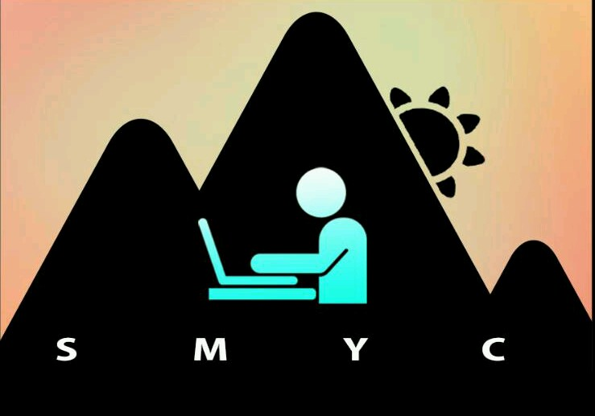
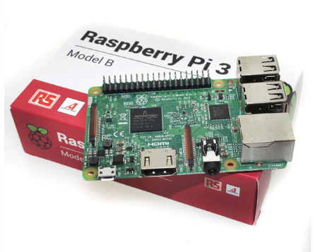

# BuddyBox

 

## Introduction
This project is part of the **Silicon Mountain Yocto-Project Community (SMYC)**. We are a group of opensource enthusiast interested in building light weight Linux distributions. We embed our operating systems in customized hardware to solve problems peculiar to our region; Cameroon, Central Africa and Africa at large.

## BuddyBox
It is an electronic electronic device as small as matrix cube with a customized light weight Linux operating system. It is initially conceived to be used primarily in our classrooms. It allows a teacher/lecturer to share his laptop’s screen with students during presentations and lectures in big size classrooms like Amphitheatre 700 and 600 of the University of Buea. It allows the lecturer to collect student assignments by allowing them to simply upload the assignments to Buddybox FTP server.

**How does it work?**
1. In a classroom, the lecturer will switch on a wireless enabled raspberry pi that hosts the light weight operating system comprising of multiple opensource platforms that incorporates the features of Buddybox.
2. Students connect to the SSID from Buddybox. Their browser automatically opens up to the login page of the Buddybox which gives them access to a virtual learning environment ([Moodle](https://mo)).
3. The lecturer decides on when to start broadcasting the power point prior to scheduling class on the platform. Upon broadcast (Live classroom session), students will be able to see the presentation done by the lecturer using his power point slides.
4. On the platform, students can chat amongst themselves, upload and save assignments for which the lecturer can correct subsequently.
5. Attendance can even be collected on the platform.

**What else?**
There are several other platfroms we could host on our Buddybox. [Nextcloud](https://nextcloud.com/) and [Owncloud](https://owncloud.org/) which are exceptionally great file sharing cloud platforms. They facilitate collaboration and file sharing. With this, BuddyBox could be an amazing tool to save millions of family pictures and videos accessible and easily portable to anyplace. When next a friend visits your house, simply tell him to connect to your BuddyBox SSID to view family pictures and videos. No more wahala with old pictures caught up in cold or torn by kids.

## Components (Hardware and Software)
Find below suggested hardware and software for this project. Recommendations are welcome:

**Hardware**
[Raspberry Pi 3 Model B](https://www.raspberrypi.org/products/raspberry-pi-3-model-b/ )

**Software**
[Apache Server](http://httpd.apache.org/docs/2.4/install.html ) - see requirements and installation guide in link
[Moodle](https://github.com/moodle/moodle) – virtual learning environment with lots of ready available features, check it on github
[Nextcloud](https://github.com/nextcloud ) – see github (Built with PHP)
[Owncloud](https://github.com/owncloud ) - see github (Built with PHP)

## BuddyBox Features
- Some features of BuddyBox include:
- Wi-Fi access
- Authentication for Login
- Role assignments
- Upload/ Download – File sharing
- Chat
- Role and Permission assignment
- Multiple course creation and Management
- Quiz assessment
- Live presentations and screen sharing
- Attendance system

## Contribution
Ideas are unlimited and there are so many amazing things to add or start a new project with.
In other to contribute to this project. Do the following:
- Clone the repository with "git clone https://github.com/SMYC/buddybox"

## Recommendations and Conclusion
It will be a good thing for students and tech enthusiasts to build customized desktop application and android applications to access Buddybox. A lot of amazing things are possible. We’ll be happy to receive recommendations from the community.

BuddyBox can incorporate both moodle and nextcloud or owncloud, nevertheless, I’ll like to recommend that the two be treated and built as two separate projects to solve each a particular situation.

## Credits
- Obia Remmy  + remyobia@gmail.com
- Molinge Jr + molingejr@gmail.com 
